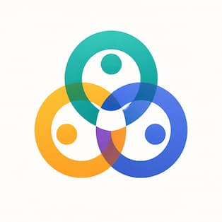

# together
Home for thinking, planning and advocating the Together project

## AI-First Repository
This repository is structured so AI agents and humans can collaborate effectively.

- Start with `AGENTS.md` for agent operating guidance.
- Use `CONTRIBUTING.md` for contribution workflow.
- Browse `docs/INDEX.md` to discover project materials.
- Use `docs/glossary.md` for shared terminology.
- Track major decisions in `decisions/`.

## Community
Join us on Discord to connect with other collaborators, discuss ideas, and get started.

**[Join the Together Discord](https://discord.gg/fuQQgsM457)**

## License

The **Together Project** is released under the  
**Creative Commons Attribution‑ShareAlike 4.0 International License (CC‑BY‑SA 4.0).**

This license allows you to:

- **Share** — copy and redistribute the material in any medium or format  
- **Adapt** — remix, transform, and build upon the material for any purpose, including commercial use  

Under the following conditions:

- **Attribution** — You must give appropriate credit, provide a link to the license, and indicate if changes were made.  
- **ShareAlike** — If you remix, transform, or build upon the material, you must distribute your contributions under the same license.

Full license text:  
https://creativecommons.org/licenses/by-sa/4.0/
